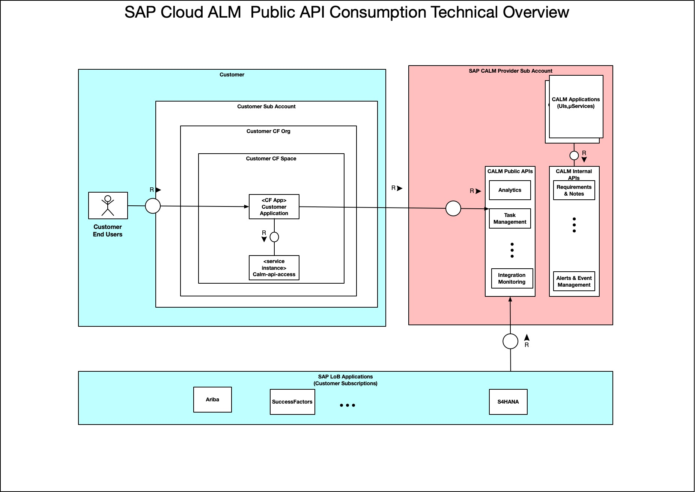

# SAP Cloud ALM Public API Reference Consumer Application


SAP Cloud ALM Public API reference application is built to showcase the method of developing a single code-line multi cloud application consuming public APIs  of SAP Cloud ALM on SAP Business Technology Platform (SAP BTP) Cloud Foundry Environment.

## Description
SAP Cloud ALM offers public APIs for Task Management and Project Management and many more functionalities of SAP Cloud ALM
#### Features of the Application

•	The sample application provides RESTful endpoints to read projects from SAP Cloud ALM.

•	It calls SAP Cloud ALM's  public API endpoints to perform the above operations on the provisioned customer tenant of SAP Clod ALM SaaS Application. 

## Architecture



A single REST controller accepts the request (GET).


## Requirements
- [Java 8](https://www.oracle.com/technetwork/java/javase/downloads/jdk8-downloads-2133151.html)
- [Apache Maven 3.3+](https://maven.apache.org/download.cgi)
- [Cloud Foundry CLI](https://github.com/cloudfoundry/cli#downloads)
- SAP Business Technology Platform Global account
- [Provision SAP Cloud ALM API Service](https://discovery-center.cloud.sap/#/serviceCatalog/object-store-service). 
- A Cloud Foundry user with SpaceDeveloper role to deploy the application

## Download and Installation

#### Build the Application
- [Clone](https://help.github.com/articles/cloning-a-repository/) the application `cloudalm-api-examples` to your system

   Clone URL :  `https://github.wdf.sap.corp/refapps/objectstore-sample.git`
- Navigate to the root folder of the application and run the below maven command to build the application:
  ```
  mvn clean install
  ```

#### Prerequisites
- SAP Business Technology Platform with CloudFoundry Runtime enabled
- Subscription to SAP Cloud ALM
#### Deploy the Application on Cloud Foundry

  1. Logon to the Cloud Foundry environment using the following commands on the command prompt:
     ```
     cf api <api>
     cf login
     ```
     `api` - [URL of the Cloud Foundry landscape](https://help.sap.com/viewer/65de2977205c403bbc107264b8eccf4b/Cloud/en-US/350356d1dc314d3199dca15bd2ab9b0e.html) that you are trying to connect to.
        
     Enter username, password, org and space when prompted to. [Please click here for more information](https://help.sap.com/viewer/65de2977205c403bbc107264b8eccf4b/Cloud/en-US/75125ef1e60e490e91eb58fe48c0f9e7.html#loio4ef907afb1254e8286882a2bdef0edf4).
    
    
  
  2. Create the Cloud Foundry SAP Cloud ALM API  Service Instance

     - To run the application create a service by executing the below command:

       `cf create-service sap-cloud-alm-api standard calm-public-api-service -c cloud-alm-api-scopes.json
        
        Note:`A sample scopes file is provided [here](https://github.com/SAP-samples/cloud-alm-api-examples/blob/main/applications/calm-api-consumer-java-sample/cloud-alm-api-scopes.json)

     

  3. Edit manifest.yml file. Replace the `<unique_id>` placeholder with any unique string. You can use your *User ID* or some unique ID so that the host name is unique in the CF landscape. 
  ~~~
  
  ---
applications:
- name: calm-public-api-consumer-sample-svc
  ------------------------------------------
 | host: <unique_id>-cloud-alm-api-sample-svc |
  ------------------------------------------
  memory: 2G
  buildpack: https://github.com/cloudfoundry/java-buildpack.git
  path: target/cloudalm-api-sample-1.0.0.jar
  services:
    - calm-public-api-service

    ---
        
  ~~~

  4. To deploy the application, navigate to the root of the application and execute the below command:
     ```
     cf push
     ```

#### Test the Application

[Postman Client](https://www.getpostman.com/apps) can be used to test / access the REST API endpoints.

Replace the `<application URL>` placeholder in the below steps with the URL of the application you deployed. 


##### List all the tasks

<b>GET</b>

To get the list of all projects  hit the below endpoint url.

EndPoint URL :   `https://<application URL>/cloud-alm/projects`

Content-Type : `application/json`

A successful upload operation gives the following response :

Status: 200

Response Body:
~~~

~~~

## How to obtain support

In case you find a bug, or you need additional support, please open an issue here in GitHub.

## Known Issues

## License

Copyright (c) 2020 SAP SE or an SAP affiliate company. All rights reserved. This project is licensed under the Apache Software License, version 2.0 except as noted otherwise in the [LICENSE](LICENSES/Apache-2.0.txt)file.
