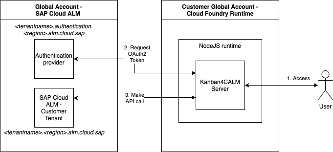
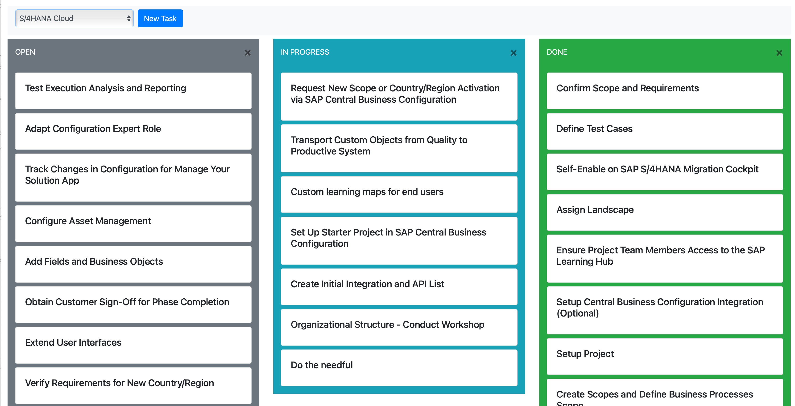

## CALM4Kanban

### Intro
This is a sample application using the [SAP Cloud ALM APIs](https://api.sap.com/package/SAPCloudALM/rest) for Project and Task Management, building a very simple kanban style board using [JQuery](https://jquery.com), [Bootstrap](https://getbootstrap.com) and [SortableJS](https://github.com/SortableJS/Sortable).
The backend part is a very simple NodeJS application, that serves the HTML component and acts as proxy to the actual API's handling the OAuth2 authorization with client_id and client_secret. The NodeJS application can either run as a standalone application, or it can be published to a CloudFoundry instance on SAP BTP

### High-Level Architecture of the example application




### How it works

The app consists of three main files
- [server/static/index.html](server/static/index.html) - Contains the client side code, a very simple bootstrap based application that uses SortableJS to create containers, fill them with tasks and manage the creation of new tasks, editing existing tasks and drag&drop to change the status
- [server/server.js](server/server.js) - Contains the server side code that serves the client side coding, handles OAuth2 authentification and making the actual API calls (incl. a bit of filtering here and there)
- [server/config.json](server/config.json) - Contains the URLs to the SAP Cloud ALM tenant API and the client credentials (client_id and client_secret) used for authentication. Please copy config.json.sample and adapt to you local needs

Additionally two supporting files:
- [server/package.json](server/package.json) - contains the required NodeJS modules, information on the runtime environment and the necessary NodeJS version to run it in CloudFoundry
- [manifest.yaml](manifest.yaml) - The manifest for pushing the application to a CloudFoundry environment [documentation can be found here](https://help.sap.com/viewer/6a4563286d06419cb9927ef448c67432/LATEST/en-US/e68e33b67c844689b07abf70e7ca5bc8.html)

From an application logic the server side application is just a proxy that handles the OAuth2 authentication and proxies the calls from the client to the API. It is also used to filter the returned projects and tasks based on their status values (only open projects and only tasks for a specific status values), as this is not yet supported natively by the APIs

### How to obtain client_id and client_secret for your customer tenant

The overall process of creating a service instance for your customer tenant is [described in SAP Help Portal](https://help.sap.com/products/CloudALM/08879d094f3b4de3ac67832f4a56a6de/704b5dc854f549888a238f94015e1eac.html)

From an authorization perspective, the application needs at least a service instance with the following authorization scope (remember to change the xsappname parameter to be unique)

```
{
    "xs-security": {
      "xsappname": "sapcloudalmapi",
      "authorities": [
        "$XSMASTERAPPNAME.calm-api.projects.read", 
        "$XSMASTERAPPNAME.calm-api.tasks.write", 
        "$XSMASTERAPPNAME.calm-api.tasks.read"
         ]
  }
}
```


### How to run?

1. Clone this repository
2. Copy config.json.sample
   ```sh
    cd applications/kanban4calm/server
    cp config.json.sample config.json
    ```
3. Adapt config.json to your environment (changing URLs and authentication information)

#### Install Dependencies

From the server directory, run:

```sh
   npm install
```

#### Start the Server Application

   - locally:
      ```sh
      node server.js
      ```
      After that you should see a message how you can access the application, typically using http://localhost:3000/ as a default

   - on Cloud Foundry:
      ```sh
      cd applications/kanban4calm/
      cf login
      cf push
      ```
      You should see something like this in the output:
      ```
      Instances starting...

      name:              kanban4calmserver
      requested state:   started
      routes:            mygeneratedapplicationrouteexample.cfapps.eu10.hana.ondemand.com
      ```

      Using the standard manifest an application route with a random generated value will be created that you can use the access the application


### Finally

This is what you should get:


And of course, thanks to @pgerundt for the jumpstart help with JQuery, Bootstrap and Sortable.JS
